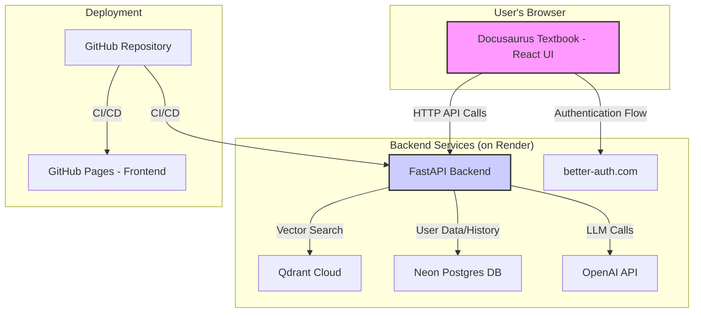

# Architectural Plan: Physical AI & Humanoid Robotics Textbook Platform

**Branch**: `001-textbook-platform`
**Spec**: `specs/001-textbook-platform/spec.md`

## 1. Scope and Dependencies

### 1.1. In Scope

*   **Textbook Content Delivery**: A web platform to host and serve the "Physical AI & Humanoid Robotics Textbook". The platform will be built using Docusaurus and deployed to GitHub Pages.
*   **RAG Chatbot**: A Retrieval-Augmented Generation chatbot integrated into the textbook interface. The chatbot will answer student questions based on the textbook's content.
*   **Content Ingestion**: Initial content will be provided as Markdown files.
*   **(Bonus) User Authentication**: User signup and sign-in functionality.
*   **(Bonus) Content Personalization**: Ability for logged-in users to tailor content based on their background (software/hardware).
*   **(Bonus) Content Localization**: Ability for logged-in users to translate content into Urdu.

### 1.2. Out of Scope

*   **Content Authoring/Editing Interface**: The platform will not provide a web-based interface for creating or editing textbook content. Content is managed directly as Markdown files in the repository.
*   **Real-time Collaboration**: No features for real-time user collaboration are included.

### 1.3. Dependencies

*   **Docusaurus**: For the static site generation of the textbook.
*   **React**: The underlying framework for Docusaurus, used for creating interactive components like the chatbot UI.
*   **FastAPI**: The Python web framework for the backend API that powers the chatbot.
*   **OpenAI Agents/ChatKit SDKs**: For building the core logic of the RAG agent.
*   **Qdrant Cloud**: Vector database for storing text embeddings and performing similarity searches for the RAG system.
*   **Neon Serverless Postgres**: Relational database for storing user data (for bonus features) and potentially chatbot conversation history.
*   **better-auth.com**: External service for user authentication (bonus feature).
*   **GitHub Pages**: Hosting platform for the Docusaurus frontend.
*   **Render (or similar)**: Hosting platform for the FastAPI backend.

## 2. System Architecture

The system is composed of two main components: a **Frontend** (the Docusaurus textbook) and a **Backend** (the FastAPI chatbot service).



### 2.1. Frontend Architecture

*   **Framework**: Docusaurus.
*   **Language**: TypeScript, React.
*   **Key Components**:
    *   **Textbook Pages**: Generated from Markdown files in the `/docs` directory.
    *   **Chatbot UI**: A new React component, likely a floating chat window, will be created in `frontend/src/components`. This component will manage the chat interface, user input, and displaying messages.
    *   **API Service**: A client-side service (`frontend/src/services/api.ts`) will be created to handle communication with the FastAPI backend. It will encapsulate all HTTP requests to the `/chat` and other future endpoints.
    *   **State Management**: React's built-in state management (useState, useContext) will be sufficient for managing the chatbot's UI state.
*   **Deployment**: Deployed as a static site to GitHub Pages via a GitHub Actions workflow.

### 2.2. Backend Architecture

*   **Framework**: FastAPI.
*   **Language**: Python.
*   **Key Components**:
    *   **API Endpoints (`backend/src/api/`)**:
        *   `/chat`: The primary endpoint for the chatbot. It will receive a user's question (and optional context), process it, and return the chatbot's response. This will be a streaming endpoint.
        *   `/users` (Bonus): Endpoints for managing user profiles.
    *   **RAG Service (`backend/src/services/rag_service.py`)**: This service will contain the core logic for the RAG pipeline.
    *   **Data Models (`backend/src/models/`)**: Pydantic models for API validation and SQLAlchemy ORM models for the `Student` entity.
    *   **Vector Store Service (`backend/src/services/qdrant_service.py`)**: A dedicated service to abstract interactions with Qdrant.
*   **Deployment**: Deployed as a web service on a platform like Render.

## 3. Data Management

### 3.1. Textbook Content

*   **Storage**: Markdown files within the `frontend/docs` directory.
*   **Ingestion into RAG**: A script will be created to read Markdown files, split them into chunks, generate embeddings, and upload them to Qdrant Cloud.

### 3.2. User Data (Bonus Feature)

*   **Storage**: Neon Serverless Postgres.
*   **Schema**: A `students` table will store user information (id, email, password, background).
*   **Migrations**: Alembic will be used to manage schema changes.

## 4. Interfaces and API Contracts

### API Endpoint: `/chat`

*   **Method**: `POST`
*   **Request Body**:
    ```json
    {
      "query": "What is robot kinematics?",
      "context_snippet": "Optional user-selected text snippet",
      "conversation_id": "optional-uuid-to-maintain-context"
    }
    ```
*   **Response**: A streaming response (`text/event-stream`) with the chatbot's answer.

## 5. Non-Functional Requirements

*   **Performance**: < 5 seconds response time (p90) via streaming. The backend will be designed to be stateless and horizontally scalable to support 51-200 concurrent users.
*   **Observability**: Use existing structured logging and implement a `/metrics` endpoint with `prometheus-client`.
*   **Security**: Enforce HTTPS, manage secrets via environment variables, and use password hashing.

## 6. Risk Analysis

| Risk | Mitigation Strategy |
| --- | --- |
| **Inaccurate Chatbot Responses** | 1. Optimize content chunking strategy. 2. Use refined prompt engineering. 3. Evaluate with a curated Q&A dataset. |
| **External API Unavailability** | 1. Implement retry logic with exponential backoff. 2. Use a circuit breaker pattern if needed. 3. Gracefully degrade the UI with clear error messages. |
| **High Latency** | 1. Use streaming responses. 2. Cache responses for identical questions. 3. Optimize vector search indexing in Qdrant. |

## 7. Evaluation and Validation

*   **Unit & Integration Tests**: Use `pytest` for the backend and `Jest`/`React Testing Library` for the frontend.
*   **E2E Tests**: Use Playwright or Cypress to automate and test key user flows.
*   **Manual Testing**: Validate user stories from `spec.md` manually.
*   **Performance Testing**: Use a tool like Locust to load-test the API.